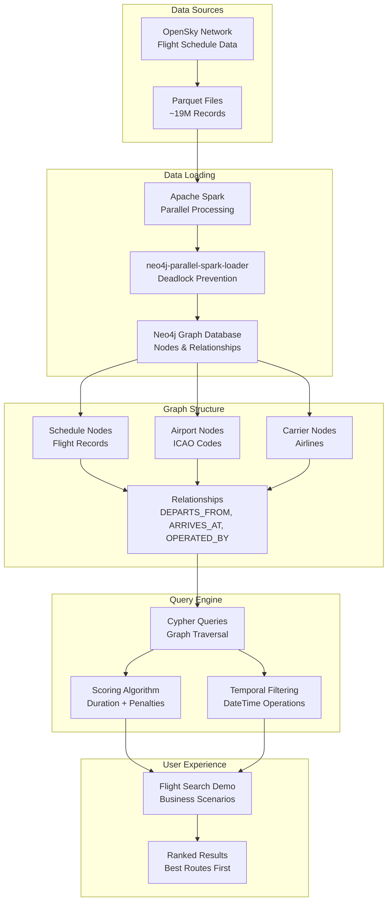

# Flight Schedule Graph Database

A Neo4j graph database system for flight schedule queries that answers realistic traveler questions like:
> *"I'm in Edinburgh and want to go to Nice on Tuesday, leaving around 10am. What are my options?"*

The system finds direct flights and multi-hop connections with proper timing validation.

## ✈️ Key Features

- **Real Flight Search**: Origin → destination with departure time preferences
- **Connection Logic**: Multi-hop routes with connection timing (45-480 minutes)
- **City Name Support**: Use "Edinburgh" instead of airport codes
- **Graph Performance**: Sub-second queries on 19M+ flight records
- **Business Logic**: Realistic connection rules and timing validation

## 🚀 Quick Start

### Option 1: Local Development

```bash
# Clone and setup
git clone <this-repo>
cd flight-search-graph

# Create conda environment
conda env create -f environment.yml
conda activate neo4j-flight-schedule

# Configure Neo4j connection
cp .env.example .env
# Edit .env with your Neo4j credentials
```

### Option 2: Docker Container

```bash
# Build container (includes Java + Python dependencies)
docker build -t flight-search .

# Run with Neo4j connection
docker run -e NEO4J_URI=bolt://host.docker.internal:7687 \
           -e NEO4J_USERNAME=neo4j \
           -e NEO4J_PASSWORD=your_password \
           -e NEO4J_DATABASE=flights \
           flight-search

# For development with local files mounted
docker run -v $(pwd):/app -it flight-search bash
```

## 📊 Complete Setup: Data to Demo

### 1. Start Neo4j Database

```bash
# Local Neo4j installation
neo4j start

# Or Docker Neo4j
docker run --name neo4j \
    -p 7474:7474 -p 7687:7687 \
    -e NEO4J_AUTH=neo4j/password \
    -e NEO4J_dbms_default__database=flights \
    neo4j:5.11
```

### 2. Configure Connection

Create `.env` file:
```bash
NEO4J_URI=bolt://localhost:7687
NEO4J_USERNAME=neo4j
NEO4J_PASSWORD=your_password
NEO4J_DATABASE=flights
```

### 3. Download Flight Data

```bash
# Download real flight schedule data (2GB Parquet files)
python download_schedule_data.py

# Check downloaded data
ls data/flight_list/
# flight_list_202401.parquet, flight_list_202402.parquet, ...
```

### 4. Load Data into Graph

```bash
# Load complete dataset (19M records) using Spark
python setup.py --load-full-dataset

# This creates:
# - 4.8M Schedule nodes
# - 991 Airport nodes  
# - 834 Carrier nodes
# - 14.4M relationships
```

### 5. Run Flight Search Demo

```bash
# Complete demo with query stats and business logic
python flight_search_demo.py

# Simple traveler scenarios
python flight_search_demo.py
```

## 🔍 Query Performance & Business Logic

### Example: Edinburgh → Nice Connection Search

**Query**: Find connection flights with timing validation
```cypher
MATCH (s1:Schedule)-[:DEPARTS_FROM]->(dep:Airport {code: 'EGPH'})
MATCH (s1)-[:ARRIVES_AT]->(hub:Airport)
MATCH (s2:Schedule)-[:DEPARTS_FROM]->(hub)
MATCH (s2)-[:ARRIVES_AT]->(arr:Airport {code: 'LFMN'})

WHERE date(s1.date_of_operation) = date('2024-06-18')
  AND date(s2.date_of_operation) = date('2024-06-18')
  AND hub.code <> 'EGPH' AND hub.code <> 'LFMN'
  AND s1.first_seen_time.hour >= 9
  AND s1.first_seen_time.hour <= 13

WITH s1, s2, hub,
     duration.between(s1.last_seen_time, s2.first_seen_time).minutes AS connection_minutes

WHERE connection_minutes >= 45 AND connection_minutes <= 300

RETURN hub.code, connection_minutes
ORDER BY s1.first_seen_time
LIMIT 8
```

**Performance**: 167ms on 19M+ records  
**Business Logic**: 45-300 minute connection window with native DateTime math  
**Graph Advantage**: 6-hop traversal + native temporal operations in single query  

### Results
```
Found 8 connections:
1. EGPH → EKCH → LFMN (70min connection)
2. EGPH → LFPG → LFMN (73min connection)
3. EGPH → LFPG → LFMN (100min connection)
```

## 🏗️ Architecture

### Data Model
```
(Schedule)-[:DEPARTS_FROM]->(Airport)
(Schedule)-[:ARRIVES_AT]->(Airport)
(Schedule)-[:OPERATED_BY]->(Carrier)
```

### Query Types
- **Direct Flights**: 3-hop graph traversal
- **Connections**: 6-hop traversal + timing validation  
- **Multi-city**: Variable-length paths

### Performance Characteristics
- **Direct searches**: <200ms
- **Connection searches**: <500ms  
- **Complex multi-hop**: <1000ms
- **Dataset queries**: <2000ms

## 🧪 Testing

```bash
# Unit tests (fast, no database)
pytest tests/test_flight_search_unit.py

# Integration tests (real database)
pytest tests/test_flight_search.py
pytest tests/test_graph_validation.py

# Performance benchmarks
pytest tests/test_performance.py

# All tests with coverage
pytest tests/ --cov=. --cov-report=term-missing
```

## 📋 Development

### Code Quality Setup
```bash
# Install pre-commit hooks (one-time setup)
pip install pre-commit
pre-commit install

# Manual checks (optional - hooks run automatically on commit)
pre-commit run --all-files

# Run tests
pytest tests/ --cov=. --cov-report=term-missing
```

### Pre-commit Hooks
The project uses pre-commit hooks to ensure code quality:
- **black**: Code formatting
- **isort**: Import sorting  
- **flake8**: Linting and style checks
- **mypy**: Type checking
- **bandit**: Security scanning

Hooks run automatically on `git commit` and prevent commits with quality issues.

### CI/CD
- Automated testing on Python 3.9, 3.10, 3.11
- Code quality enforcement (black, isort, flake8, mypy)
- Security scanning (bandit, safety)
- Performance validation
- Docker build verification

## 🛠️ Core Scripts

| Script | Purpose |
|--------|---------|
| `flight_search_demo.py` | Complete demo with query stats and business scenarios |
| `download_schedule_data.py` | Download real flight data |
| `load_with_parallel_spark.py` | Load data using Spark |
| `setup.py` | Database setup and orchestration |

## 📊 Dataset

- **Source**: Real flight schedule data from OpenSky Network
- **Scale**: 19M+ flight schedules across 18 months (2024-2025)
- **Coverage**: 991 airports, 834 airlines worldwide
- **Format**: Parquet
- **Size**: ~2GB compressed

## 🏗️ System Architecture



## 🎯 Technical Approach

### Graph Database Benefits
- **Single query** finds multi-hop connection paths
- **Relationship-based modeling** matches real-world flight networks
- **Variable-length path queries** for flexible routing
- **Real-time connection validation** during graph traversal

### Data Pipeline
- **Apache Spark** for parallel processing of large parquet files  
- **[neo4j-parallel-spark-loader](https://github.com/neo4j-field/neo4j-parallel-spark-loader)** prevents deadlocks during relationship creation by partitioning data into non-overlapping batches
- **Temporal indexing** on departure/arrival times for query performance
- **Constraint-based** data integrity with unique node identification

### Why neo4j-parallel-spark-loader?
When loading millions of relationships in parallel, multiple Spark workers can attempt to create relationships to the same node simultaneously, causing deadlocks in Neo4j. This library solves the problem by:
- **Bipartite partitioning**: Groups relationships so no node appears in multiple concurrent batches
- **Batch processing**: Ensures parallel workers never conflict when writing to the database

### Query Performance
The system demonstrates sub-second response times for complex multi-hop flight searches on datasets with millions of flight records.

## 📄 License

This project is provided as-is for demonstration purposes.
