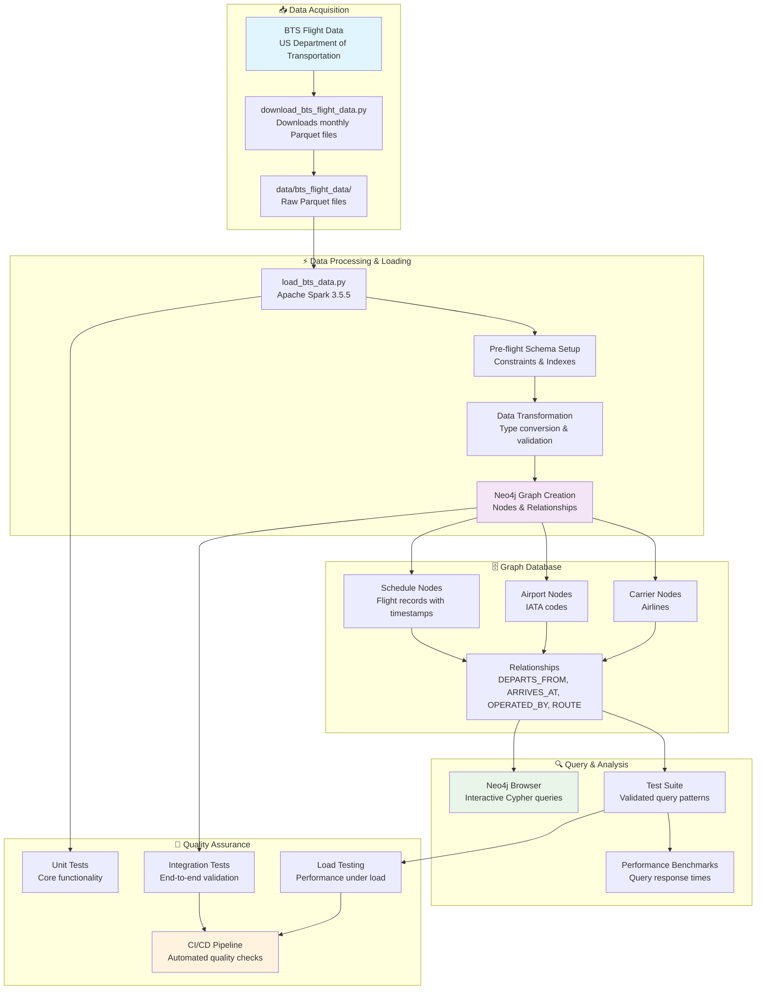

# BTS Flight Data Processing System

[](https://github.com/alexwoolford/flight-schedule/actions/workflows/ci.yml)
[](https://codecov.io/gh/alexwoolford/flight-schedule)
[](https://www.python.org/downloads/)
[](https://spark.apache.org/)
[](https://neo4j.com/)
[](https://www.transtats.bts.gov/)
[](https://github.com/alexwoolford/flight-schedule/commits/main)
[](https://github.com/alexwoolford/flight-schedule/issues)
[](https://github.com/alexwoolford/flight-schedule/pulls)

A Neo4j graph database system that loads real Bureau of Transportation Statistics (BTS) flight data using Apache Spark, for flight schedule analysis and graph-based route queries.

> *Load a full year of real US domestic flight records — 7,001,619 of them — and query routes over them in Cypher.*

The system provides a complete pipeline from BTS data download to Neo4j graph creation.

## ✈️ What's in the graph

Loaded from the 2025 BTS On-Time Performance dataset (all 12 months):

| | |
|---|---|
| **Flights in source data** | 7,001,619 |
| **`Schedule` nodes** | 6,898,743 (cancelled flights are filtered at load) |
| **`Airport` nodes** | 352 |
| **`Carrier` nodes** | 14 |
| **Relationships** | 20,696,229 (3 per `Schedule`) |

Every record corresponds to a real BTS-reported flight. This project never generates
synthetic data.

## 🚀 Guided Setup (~45-50 minutes end to end)

```bash
git clone https://github.com/alexwoolford/flight-schedule.git && cd flight-schedule && ./setup-and-run.sh
```

The script is interactive — it prompts for your Neo4j credentials, then:
- creates the conda environment
- downloads all 12 months of 2025 BTS data (~226 MB, 10-15 min)
- creates the target database if needed and loads the graph (~30 min)
- runs the unit test suite

**Prerequisites:** [Conda](https://docs.conda.io/en/latest/miniconda.html) +
Neo4j 5.25+ + 16GB RAM + 10GB disk + internet access on the first load
(Spark fetches the Neo4j connector JAR).

Prefer to run the steps yourself? See **Complete Setup** below — the manual path
is fully documented and is what the script automates.

---

## 🔧 Manual Setup (If You Prefer Step-by-Step)

### Option 1: Conda Setup (Recommended)

```bash
# Clone and setup
git clone https://github.com/alexwoolford/flight-schedule.git
cd flight-schedule

# Create complete environment (Python + Java + all dependencies)
conda env create -f environment.yml
conda activate flight-schedule

# Configure Neo4j connection
cp .env.example .env
# Edit .env with your Neo4j credentials
```

### Option 2: Docker Container (Alternative for Non-Conda Users)

```bash
# Build container with exact dependencies
docker build -t flight-schedule .

# Test container setup
docker run --rm flight-schedule

# Run with Neo4j connection
docker run -e NEO4J_URI=bolt://host.docker.internal:7687 \
           -e NEO4J_USERNAME=neo4j \
           -e NEO4J_PASSWORD=your_password \
           -e NEO4J_DATABASE=flights \
           flight-schedule python load_bts_data.py --help

# For development with local files mounted
docker run -v $(pwd):/app -it flight-schedule bash
```

## 📊 Complete Setup: Data to Demo

### 1. Start Neo4j Database

Neo4j **5.25 or newer** is required (the loader writes `LocalDateTime` values and
uses `SHOW CONSTRAINTS` to verify schema setup).

```bash
# Local Neo4j installation
neo4j start

# Or Docker Neo4j
docker run --name neo4j \
    -p 7474:7474 -p 7687:7687 \
    -e NEO4J_AUTH=neo4j/password \
    neo4j:5.26
```

Then create the database this project loads into. In Neo4j Browser
(http://localhost:7474) or `cypher-shell`, against the `system` database:

```cypher
CREATE DATABASE flights IF NOT EXISTS;
```

> **Neo4j Community Edition** supports only one database, named `neo4j`. On
> Community — and on Aura — set `NEO4J_DATABASE=neo4j` in step 2 and skip the
> `CREATE DATABASE` above. Everything else is identical.

### 2. Configure Connection

```bash
cp .env.example .env
```

Then edit `.env` with your real values:

```bash
NEO4J_URI=bolt://localhost:7687
NEO4J_USERNAME=neo4j
NEO4J_PASSWORD=your_password
NEO4J_DATABASE=flights      # use "neo4j" on Aura or Community Edition
```

Every script reads these via `load_dotenv()`; nothing is hard-coded.

### 3. Download Flight Data

```bash
# Download all 12 months of 2025 BTS data (~226 MB of Parquet, 10-15 min)
python download_bts_flight_data.py

# Check downloaded data
ls data/bts_flight_data/
# bts_flights_2025_01.parquet, bts_flights_2025_02.parquet, ...

# Optional: confirm counts and cross-file schema consistency
python download_bts_flight_data.py --summary
python download_bts_flight_data.py --validate
```

To iterate faster, download a single month instead:

```bash
python download_bts_flight_data.py --year 2025 --month 3
```

### 4. Load Data into Graph

```bash
# Load ALL BTS data into Neo4j using Spark (~30 min for the full year)
python load_bts_data.py --load-all-files --data-path data/bts_flight_data
```

This creates, from the full 2025 dataset:

- **6,898,743** `Schedule` nodes (7,001,619 flights minus cancellations)
- **352** `Airport` nodes
- **14** `Carrier` nodes
- **20,696,229** per-flight relationships — `DEPARTS_FROM`, `ARRIVES_AT`,
  `OPERATED_BY` (one of each per `Schedule`)
- **6,933** `ROUTE` relationships — the aggregated `Airport`→`Airport` network,
  one edge per distinct directed route

On first run the loader creates 3 uniqueness constraints and 8 indexes, then
verifies the constraints exist via `SHOW CONSTRAINTS` before loading anything.
It is **idempotent** — node and relationship writes use `MERGE` on the key
properties, so re-running against a populated database updates in place rather
than duplicating.

The Neo4j Spark Connector is a JAR downloaded at runtime by Spark (pinned in
`load_bts_data.py`), so the **first** run needs internet access beyond the BTS
download. Version **5.4.0+ is required**: earlier connectors silently write
`timestamp_ntz` columns as raw epoch integers instead of `LocalDateTime`.

### 5. Verify Installation

```bash
# Unit tests (no database needed)
pytest tests/test_ci_unit.py tests/test_flight_search_unit.py \
       tests/test_download_bts_unit.py tests/test_load_bts_unit.py \
       tests/test_system_validation_unit.py -v
```

Then confirm the graph itself, in Neo4j Browser or `cypher-shell`:

```cypher
MATCH (s:Schedule) RETURN count(s) AS schedules;
SHOW CONSTRAINTS;
```

## 🔍 Example Queries

### Direct flights on a route and date

```cypher
MATCH (:Airport {code: 'LGA'})<-[:DEPARTS_FROM]-(s:Schedule)-[:ARRIVES_AT]->(:Airport {code: 'DFW'})
WHERE s.flightdate = date('2025-01-15')
RETURN s.reporting_airline + toString(s.flight_number_reporting_airline) AS flight,
       s.scheduled_departure_time AS departs,
       s.scheduled_arrival_time AS arrives,
       s.scheduled_duration_minutes AS minutes
ORDER BY departs;
```

### One-stop connections through a hub

```cypher
MATCH (:Airport {code: $origin})<-[:DEPARTS_FROM]-(s1:Schedule)-[:ARRIVES_AT]->(hub:Airport)
      <-[:DEPARTS_FROM]-(s2:Schedule)-[:ARRIVES_AT]->(:Airport {code: $dest})
WHERE s1.flightdate = date($date)
  // Allow the second leg to spill into the next day
  AND s2.flightdate IN [date($date), date($date) + duration('P1D')]
  AND hub.code <> $origin AND hub.code <> $dest
  // Same carrier throughout: splicing two unrelated airlines produces an
  // itinerary nobody can actually sell you. Drop to allow interlining.
  AND s1.reporting_airline = s2.reporting_airline
WITH s1, s2, hub,
     // Both timestamps are local to the same hub, so this subtraction is valid
     // (unlike arrival - departure, which spans two timezones).
     duration.inSeconds(s1.scheduled_arrival_time,
                        s2.scheduled_departure_time).seconds / 60 AS layover
WHERE layover >= $min_layover AND layover <= $max_layover
RETURN [s1.reporting_airline + toString(s1.flight_number_reporting_airline),
        s2.reporting_airline + toString(s2.flight_number_reporting_airline)] AS flights,
       hub.code AS via,
       s1.scheduled_departure_time AS departs,
       s2.scheduled_arrival_time AS arrives,
       layover,
       s1.scheduled_duration_minutes + s2.scheduled_duration_minutes AS air_minutes
ORDER BY departs
LIMIT $limit
```

Note `duration.inSeconds(...)`, **not** `duration.between(...).minutes` — the
`.minutes` accessor covers only the seconds component group and **excludes whole
days**, so a 25½-hour span reports as 90 minutes.

### Variable-depth routing with quantified path patterns

Direct, 1-stop, or 2-stop itineraries from **one query with one number to change**.
First build the connection edges for the date(s) you want to search:

```bash
python load_bts_data.py --build-connections 2025-07-18
```

That materialises `(:Schedule)-[:CONNECTS_TO {layover_minutes}]->(:Schedule)` for
every bookable connection — same carrier or its wholly-owned regional affiliate,
45-300 minute layover, no backtracking, no overnight inbound leg. ~625K edges per
day, built in ~12 seconds, idempotent.

```cypher
MATCH (first:Schedule)-[:DEPARTS_FROM]->(:Airport {code: $origin})
WHERE first.flightdate = date($date)
MATCH p = (first)-[:CONNECTS_TO]->{0,2}(last:Schedule)
MATCH (last)-[:ARRIVES_AT]->(:Airport {code: $dest})
WITH p, nodes(p) AS legs, relationships(p) AS conns
RETURN size(legs) - 1 AS stops,
       [f IN legs | f.reporting_airline + toString(f.flight_number_reporting_airline)] AS flights,
       [f IN legs | f.origin + '-' + f.dest] AS route,
       reduce(t = 0, f IN legs | t + f.scheduled_duration_minutes) AS air_minutes,
       reduce(t = 0, c IN conns | t + c.layover_minutes) AS layover_minutes
ORDER BY stops, air_minutes + layover_minutes
LIMIT 5
```

`{0,2}` is direct + 1-stop + 2-stop. `{0,3}` adds another leg. Nothing else
changes.

Measured, LGA→DFW on 2025-07-18:

| query | wall clock | itineraries |
|---|---|---|
| QPP `{1,1}` (1-stop) | **185 ms** | 135 |
| explicit 1-stop join | **182 ms** | 135 |
| QPP `{0,2}` | **102 ms** | 1,736 |
| QPP `{0,3}` | **492 ms** | 13,625 |

At 1-stop it matches the hand-written join exactly — same 135 itineraries, same
latency. Beyond 1-stop there is no join to compare against without hand-writing a
new `MATCH` block per hop count. Across 12 routes at `{0,2}`: median **113 ms**.

Where it earns its keep — routes with no nonstop at all:

| route | wall clock | best itinerary |
|---|---|---|
| GUM→BOS | **1.2 ms** | GUM-HNL, HNL-DEN, DEN-BOS |
| FCA→SAV | **7.6 ms** | FCA-DEN, DEN-SAV |
| BOI→ALB | **28.5 ms** | BOI-MDW, MDW-ALB |

**The `CONNECTS_TO` edge is what makes this work.** Writing the same QPP over
`Schedule → Airport → Schedule` is 200-400x slower, because `Airport` is a
supernode with no date property: reaching a hub forces the next hop to bind
3,783,541 candidate flights to keep 11,695. Materialising the connection removes
that juncture and puts the connection rules in the edge, so no query can
accidentally splice two unrelated carriers into an unsellable itinerary.

> 📖 [ROUTING_QUERY_REFERENCE.md](ROUTING_QUERY_REFERENCE.md) has the full
> measurements, the cost/scope tradeoff (a full year would be ~228M edges), how
> the edges were validated against published airline route data, and why moving
> predicates inside the quantifier does *not* fix the supernode problem.
>
> The shipped load test (`neo4j_flight_load_test.py`) still uses an older
> formulation with the flawed duration idiom and no carrier predicate; migrating
> it is an open task.

## 🏗️ Architecture

### Data Model

Loaded for every flight:
```
(Schedule)-[:DEPARTS_FROM]->(Airport)
(Schedule)-[:ARRIVES_AT]->(Airport)
(Schedule)-[:OPERATED_BY]->(Carrier)
```

Derived projections:
```
(Airport)-[:ROUTE {flights, carriers, first_date, last_date}]->(Airport)
(Schedule)-[:CONNECTS_TO {layover_minutes}]->(Schedule)
```

`Airport` and `Carrier` carry only a `code`. `Schedule` holds everything else.

**`CONNECTS_TO`** is what makes variable-depth routing fast — one edge per
*bookable* connection, so a quantified path pattern walks flight-to-flight instead
of crossing the `Airport` supernode. Date-scoped and built on demand:
`python load_bts_data.py --build-connections 2025-07-18` (~625K edges/day, ~12s).

"Bookable" is enforced in the edge and externally validated against published
route data: 45–300 minute layover, no backtrack, no inbound leg that really lands
the next day, and same *marketing* carrier. That last point is subtle — BTS reports
only the operating carrier, so treating `MQ`/`OH` (wholly-owned American Eagle
subsidiaries) as distinct from `AA` drops 112,501 sellable connections a day. See
`CARRIER_FAMILY` in `load_bts_data.py`. Because the policy lives in the edge,
changing it means rebuilding with `--rebuild-connections`.

**`ROUTE`** is an aggregated topology projection — one edge per distinct
`(origin, dest)` pair with service counts and date span, rebuilt from the graph at
the end of every load. Useful as a cheap hub pre-filter, but it has no time
dimension, so it overstates what is actually bookable (66 claimed hubs for
LGA→DFW versus 26 real ones). Not an itinerary search. See
[ROUTING_QUERY_REFERENCE.md](ROUTING_QUERY_REFERENCE.md).

`Schedule` has **no surrogate ID** — its identity is the 5-part composite key
`(flightdate, reporting_airline, flight_number_reporting_airline, origin, dest)`,
enforced by the `schedule_composite_unique` constraint. Minting a synthetic
`schedule_id` would mean inventing data, which this project does not do.

### Key properties on `Schedule`

| Property | Type | Notes |
|---|---|---|
| `flightdate` | `Date` | |
| `scheduled_departure_time` | `LocalDateTime` | local wall-clock **at the origin** |
| `scheduled_arrival_time` | `LocalDateTime` | local wall-clock **at the destination** |
| `scheduled_duration_minutes` | `Integer` | BTS scheduled block time — **use this for duration** |
| `actual_duration_minutes` | `Integer` | BTS actual elapsed time |
| `origin`, `dest` | `String` | IATA codes (also reachable via relationships) |
| `reporting_airline` | `String` | |
| `flight_number_reporting_airline` | `String` | |

Property names are BTS CSV column names, lowercased with spaces → underscores.

> ⚠️ **Never compute a flight duration as arrival − departure.** The two
> timestamps are local to *different* airports, so their difference is wrong
> for every flight that crosses a timezone — roughly half the dataset. Use
> `scheduled_duration_minutes`, which is BTS's own reported block time and is
> both timezone- and DST-independent.
>
> Layover arithmetic at a connecting hub *is* sound, because both timestamps
> there are local to the same airport.

## 🧪 Testing

```bash
# Unit tests — exactly what CI runs, no database needed
pytest tests/test_ci_unit.py tests/test_flight_search_unit.py \
       tests/test_download_bts_unit.py tests/test_load_bts_unit.py \
       tests/test_system_validation_unit.py -v --cov=. --cov-report=term-missing

# Tests that need a loaded database
pytest tests/test_connection_logic.py tests/test_graph_validation.py -v
```

These read the date under test out of the graph (`search_date` in
`tests/conftest.py`) rather than hard-coding one, so they pass against any loaded
year and skip cleanly when the database is empty or unreachable.

Not all test files in `tests/` currently pass: `test_performance.py` and parts of
`test_integration_heavy.py` query property names from an earlier version of the
schema. Neither is in the CI gate; `.github/workflows/ci.yml` defines the gate
that matters.

## 🚀 Load Testing

A [Locust](https://locust.io/) harness for driving concurrent query load at the
graph.

```bash
locust -f neo4j_flight_load_test.py
# then open http://localhost:8089

# or headless
locust -f neo4j_flight_load_test.py \
       --users 50 --spawn-rate 5 --run-time 300s --headless
```

Each simulated user picks a random origin, destination, and date from values read
out of your database, then runs one of two tasks:

| Weight | Task |
|---|---|
| 70% | Count direct flights on a route and date |
| 30% | Search 1-stop connections through a hub |

### ⚠️ Read before trusting the numbers

This harness measures *something*, but it is not a realistic traffic model, and
it has known sampling defects:

- **`_load_airports()` samples the wrong airports.** It orders airports
  lexicographically and takes the first 100, giving a universe of ABE…ELM. That
  excludes most major hubs — ORD, LAX, JFK, LGA, SFO, EWR, MIA, SEA, PHX, LAS,
  ATL and more cannot be sampled at all. Most randomly-drawn routes therefore
  have no flights, and the majority of the 70%-weighted task returns zero rows.
- **Per-route stats names.** Each airport pair is passed as Locust's request
  `name`, so percentiles are computed over 1-2 samples per entry rather than
  aggregated. `quick_load_test_analysis.py` does not match these names and labels
  everything "Other".
- **One driver per simulated user**, so results include driver and connection
  setup, not pure query time.
- **The routing task uses the arrival-minus-departure duration idiom**, which is
  affected by the timezone issue described under *Architecture*.

Fixing these is a good first contribution. Until then, treat any figure it
produces as a relative smoke test rather than a benchmark.

`generate_flight_scenarios.py` writes `flight_test_scenarios.json`, but nothing
reads that file — the load test queries the database directly.

> 📖 See `LOAD_TESTING_GUIDE.md` for more detail (note it describes some options
> that are not implemented).

## 📋 Development

### Code Quality Setup
```bash
# Install pre-commit hooks (one-time setup, inside the conda env)
conda install -c conda-forge pre-commit
pre-commit install

# Manual checks (optional - hooks run automatically on commit)
pre-commit run --all-files
```

Dependencies belong in `environment.yml` — this project uses conda only and has
no `requirements.txt`.

### Pre-commit Hooks
The project uses pre-commit hooks to ensure code quality:
- **black**: Code formatting
- **isort**: Import sorting
- **flake8**: Linting and style checks
- **mypy**: Type checking
- **bandit**: Security scanning

Hooks run automatically on `git commit` and prevent commits with quality issues.

### CI/CD
`.github/workflows/ci.yml` enforces, as hard failures: `black --check`,
`isort --check-only`, `flake8` error-class checks, and the 5 unit test files
listed above. `mypy`, `bandit`, and `safety` run with `continue-on-error`.

Note the Python version matrix is cosmetic — the conda step installs the
interpreter pinned by `environment.yml` (3.12.8), so every leg runs the same
Python.

## 🛠️ Scripts

| Script | Purpose |
|--------|---------|
| `setup-and-run.sh` | Interactive end-to-end setup: env → download → load → validate |
| `download_bts_flight_data.py` | Downloads BTS monthly data to normalized Parquet |
| `load_bts_data.py` | Loads Parquet into Neo4j via Spark; owns all schema setup |
| `neo4j_flight_load_test.py` | Locust load test (see caveats above) |
| `quick_load_test_analysis.py` | CLI summary of a Locust stats CSV |
| `generate_flight_scenarios.py` | Writes `flight_test_scenarios.json` — currently unused by any script |

There is no package or `src/` directory; the three pipeline scripts sit at the
repo root and tests import them as modules.

## 📊 Dataset

- **Source**: [Bureau of Transportation Statistics](https://www.transtats.bts.gov/) On-Time Performance, US DOT
- **Scale**: 7,001,619 real flight records — all 12 months of 2025
- **Coverage**: US domestic flights, 14 reporting airlines, 352 airports
- **Format**: Parquet, written through a fixed ~110-column schema so every
  month is byte-compatible (BTS's own monthly CSVs are not dtype-stable)
- **Filtering at load**: cancelled flights are dropped; diverted flights are
  kept, including a small number that never reached the airport their
  `ARRIVES_AT` edge points to

To load a different year, pass `--year`:

```bash
python download_bts_flight_data.py --year 2024
```

## 🏗️ Current System Workflow


```mermaid
graph TB
    subgraph "📥 Data Acquisition"
        A[BTS Flight Data<br/>US Department of Transportation]
        B[download_bts_flight_data.py<br/>Downloads monthly Parquet files]
        C[data/bts_flight_data/<br/>Raw Parquet files]
    end

    subgraph "⚡ Data Processing & Loading"
        D[load_bts_data.py<br/>Apache Spark 3.5.5]
        E[Pre-flight Schema Setup<br/>Constraints & Indexes]
        F[Data Transformation<br/>Type conversion & validation]
        G[Neo4j Graph Creation<br/>Nodes & Relationships]
    end

    subgraph "🗄️ Graph Database"
        H[Schedule Nodes<br/>Flight records with timestamps]
        I[Airport Nodes<br/>IATA codes]
        J[Carrier Nodes<br/>Airlines]
        K[Relationships<br/>DEPARTS_FROM, ARRIVES_AT, OPERATED_BY, ROUTE]
    end

    subgraph "🔍 Query & Analysis"
        L[Neo4j Browser<br/>Interactive Cypher queries]
        M[Test Suite<br/>Validated query patterns]
        N[Performance Benchmarks<br/>Query response times]
    end

    subgraph "🧪 Quality Assurance"
        O[Unit Tests<br/>Core functionality]
        P[Integration Tests<br/>End-to-end validation]
        R[Load Testing<br/>Performance under load]
        Q[CI/CD Pipeline<br/>Automated quality checks]
    end

    A --> B
    B --> C
    C --> D
    D --> E
    E --> F
    F --> G
    G --> H
    G --> I
    G --> J
    H --> K
    I --> K
    J --> K
    K --> L
    K --> M
    M --> N
    D --> O
    G --> P
    M --> R
    P --> Q
    R --> Q

    style A fill:#e1f5fe
    style G fill:#f3e5f5
    style L fill:#e8f5e8
    style Q fill:#fff3e0
```

## 🎯 How the Pipeline Works

### Why the download step normalizes types

BTS's monthly CSVs are **not dtype-stable across months**, which caused
`ClassCastException` and `TIMESTAMP(NANOS)` failures in Spark. So
`download_bts_flight_data.py` declares an explicit ~110-column type map plus a
matching PyArrow schema and writes every month through it, flooring timestamps
to microseconds (Spark cannot read nanosecond Parquet timestamps).
`--validate` re-checks consistency afterwards.

`load_bts_data.py` still keeps a three-tier fallback on the Parquet read: strict
→ permissive with `mergeSchema` → per-file reads that union whatever succeeds.
If you see "individual file processing" in the output, a month's schema drifted
and is worth investigating rather than ignoring.

### Schema setup

`setup_database_schema()` in `load_bts_data.py` is the single source of truth for
all indexes and constraints — there are no `.cypher` files. It runs as a
pre-flight step on every load, and now **verifies via `SHOW CONSTRAINTS`** that
the 3 uniqueness constraints actually exist rather than assuming creation
succeeded. Add or change indexes there.

The index set is deliberately pruned based on `readCount` analysis; unused
indexes cost write throughput during bulk loading.

### Relationship loading

Relationship writes go through `neo4j_parallel_spark_loader`'s
`group_and_batch_spark_dataframe`, which partitions by source/target so
concurrent writers never touch the same nodes. Without it, parallel relationship
creation deadlocks in Neo4j. `--no-parallel-loader` disables this, for debugging
only.

Both loader scripts log to `logs/{script}_{timestamp}.log`.

### Generated files — regenerate, never commit

| File | Regenerate with |
|---|---|
| `data/bts_flight_data/*.parquet` | `python download_bts_flight_data.py` |
| `logs/*.log` | produced on every run |

## 🚀 Ideas for Extension

Some data is already loaded but unqueried, and points at better-supported
projects than flight search:

- **`tail_number`** is 100% populated and used by zero queries. Sorting by
  `(tail_number, flightdate, crsdeptime)` reconstructs each aircraft's rotation:
  ~97% of consecutive same-tail pairs have `next.origin == this.dest`, and the
  ~3% that don't are themselves a diagnostic signal. A single added
  `(:Schedule)-[:NEXT_LEG {ground_minutes}]->(:Schedule)` relationship would
  make **delay propagation** queryable — and unlike route duration, it doesn't
  depend on any timezone arithmetic.
- **Delay properties** (`departure_delay_minutes`, `arrival_delay_minutes`, and
  the actual-time properties) are loaded and unused. BTS attributes more delay
  minutes to late-arriving aircraft than to any other single cause.
- **Cancellations are currently discarded at load.** They're a real signal, not
  noise — out-of-position aircraft sharply raise the next leg's cancellation
  probability.

## 📄 License

This project is provided as-is for demonstration purposes.
